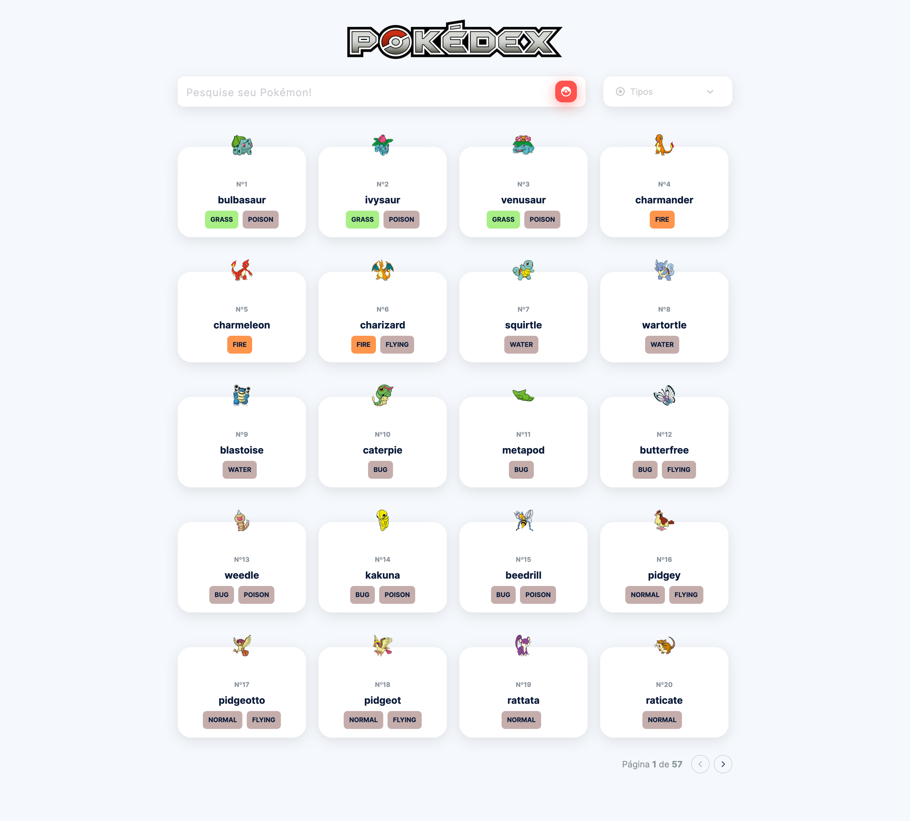

<h1 align="center">

</h1>

<p align="center">
 <a href="#-sobre">Sobre</a> |
 <a href="#-requisitos">Requisitos</a> |
 <a href="#-tecnologias">Tecnologias</a> |
 <a href="#%EF%B8%8F-como-executar">Como executar</a>
</p>

<h1 align="center">
  
</h1>

## 🚀 Sobre
Esse é um projeto desenvolvido para o desafio de teste front-end da empresa [**Evnts**](https://evnts.com.br/).

## 📚 Requisitos
- Ter [**Git**](https://git-scm.com/) para clonar o projeto.
- Ter [**Yarn**](https://yarnpkg.com/) instalado.

## 🚀 Principais Tecnologias
- [ReactJS](https://github.com/facebook/react)
- [TypeScript](https://github.com/microsoft/TypeScript)
- [Styled Components](https://github.com/styled-components/styled-components)
- [Formik](https://github.com/unform/unform)
- [Axios](https://github.com/axios/axios)
- [ESLint](https://github.com/eslint/eslint)
- [Prettier](https://github.com/prettier/prettier)

## ⚙️ Como executar

```bash

    # Clonar o repositório
    $ git clone https://github.com/claudianopl/pokedex.git

    # Navegar para o diretório
    $ cd pokedex

    # Instale as dependências
    $ yarn

    # Iniciando a aplicação
    $ yarn start

```

---
Feito com 💜 by Claudiano Lima
